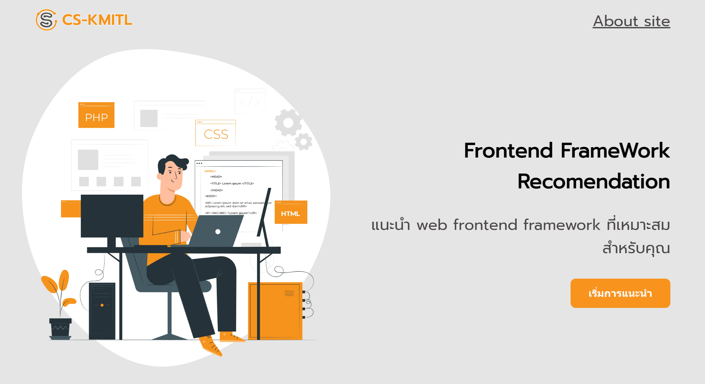
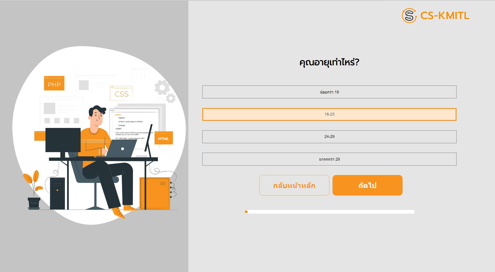
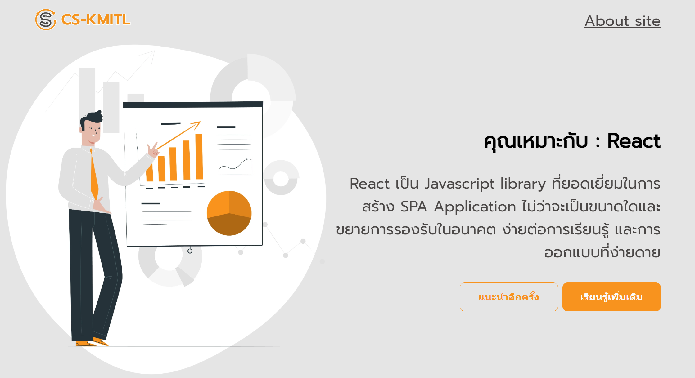
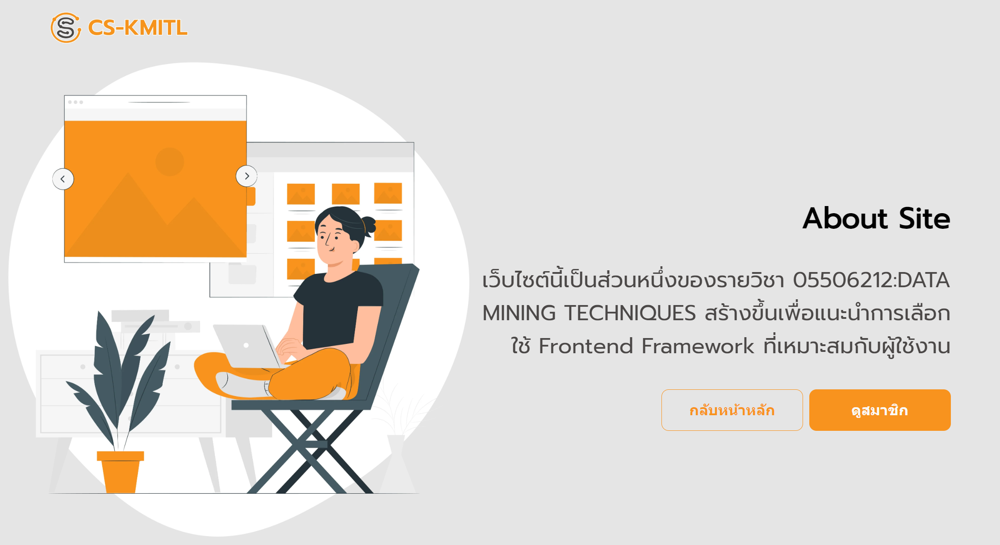
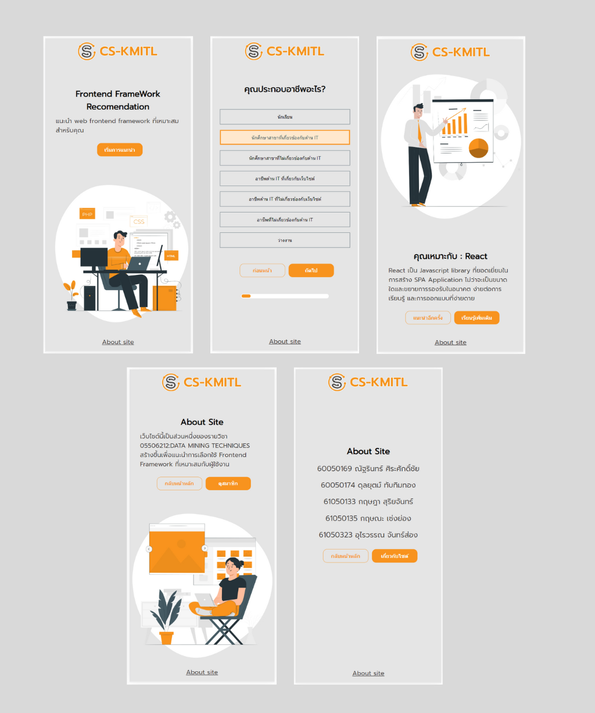

# Frontend Framework Recommendation WEB
## การติดตั้ง

- ต้องการ Node.js

หลังจากการ clone repository ทำการติดตั้ง node_modules
```
cd web-data-mine
npm install
```
ตั้งค่า environment 
- สร้างไฟล์ .env ที่ root folder
- ใส่ค่า NEXT_PUBLIC_API_URI=urlของตัวAPI

ทำการ build 
```
npm run build
```

ทำการรันโปรแกรม
```
npm start
```


# Screen Shots

> First Page



> Question Page



> Predict Result Page



> About Page



> Member Page


### Mobile

